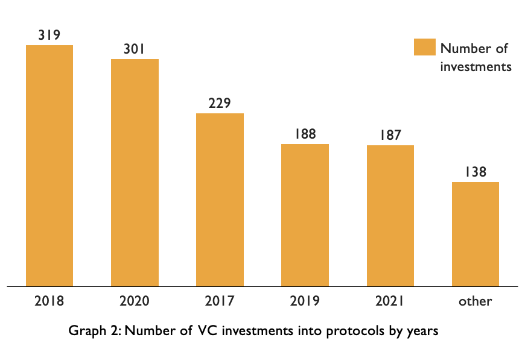

# Venture capital in Defi

Venture Capital in Decentralized Finance - quick intro:

- Venture capitalists are not safe from FOMO
- There is a group of investment firms that controls the majority of assets
- Small investors shape the community and determine the success of decentralization

We analyzed data about VCs in decentralized finance to answer our questions. Here is a quick thread with the initial insights:

1. Venture capitalists are not safe from FOMO (Fear of Missing Out). The largest number of investments in crypto by venture capitalists was made during the periods when crypto was hyped the most.

Notes: When markets are over-heated founders raise more funds with inflated valuations.

2. Some VC funds are attracted by asymmetric returns, but not by the prospects of the blockchain technology itself. To minimize their portfolio risk from the volatility of the crypto assets VC firms need to gradually sell their positions even before protocols find their market fits.

3. Venture capital investments in the crypto space accelerated in the last 3 years. 80%. of all the investments were attracted since 2017.

4. A small group of investors that include Pantera Capital, Digital Currency Group, Naval Ravikant started investing in blockchain startups back in 2014 which is considered early in crypto terms.

5. Increased interest from venture capitalists hurts small investors. Mastodons of the VC market extract value from the juiciest deals.

6. In July this year, 21 investors, including Polychain, tried to purchase a large portion of Sushiswap treasury with a 30% discount. The deal was rejected by the community of $SUSHI holders in a decentralized governance vote.

7. Detractors worry that would be a startling regression for an industry that strives toward—or at least claims to strive toward—financial egalitarianism. As one trader, 0xChimp, [wrote in a SushiSwap forum](https://forum.sushi.com/t/sushi-phantom-troupe-strategic-raise/4554): “Smooth talking tradfi suits trying to schmooze themselves into buying your bags at a discount only to dump on you in 6 months. Thanks but no thanks.” - quote from [https://decrypt.co/76291/sushiswap-proposal-to-give-vcs-discounts-draws-controversy](https://decrypt.co/76291/sushiswap-proposal-to-give-vcs-discounts-draws-controversy)

8. Results of the recent controversy around Uniswap proposal that could let flipside crypto manage $25M in $UNI manifest how VC firms have an intention to stir the protocol governance in their own interest. [https://twitter.com/bantg/status/1428513089734037509?s=21](https://twitter.com/bantg/status/1428513089734037509?s=21)

9. Decentralized governance will play an even larger role in protocol development in the future. Increased financial inclusion of small investors is paramount for the eventual success of decentralization.

10. To understand the current state of the market we identified the largest funds involved in crypto by their size using the data disclosed on Crunchbase. Mastodonts of traditional markets are moving into crypto.

11. VC investors propel the space even during the deepest bear markets. Early involvement of VC firms often becomes a catalyst for mass adoption through protocol development. Hayden shared [https://twitter.com/haydenzadams/status/1360031080867373059](https://twitter.com/haydenzadams/status/1360031080867373059) that they can even let you sleep on their couch when you need it.

12. As crypto becomes widespread and larger financial institutions are entering the market with their own interests, the original goal of decentralization of finance for the masses must remain intact. Decentralized finance embodies the idea of financial inclusion. We should remember crypto is not yet another market, it is the market for the people.